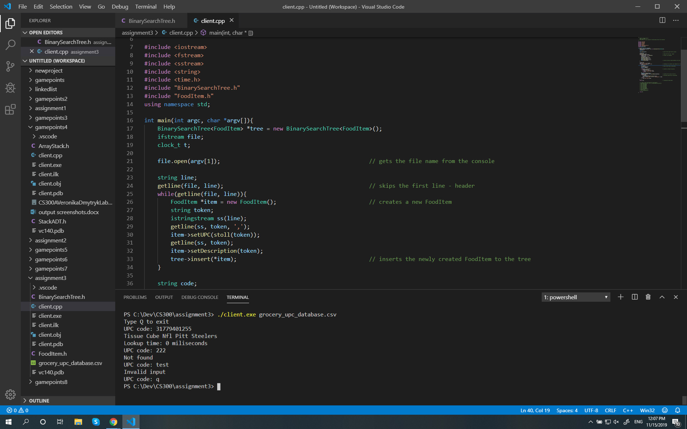

# Barcode Scanner

Barcode Scanner application allows a user to provide a custom dataset (an input file) with items with UPC code and description. It stores the data in a binary search tree. using a UPC code allows users to search quickly and efficiently. O(logN) 

## Getting Started

These instructions will get you a copy of the project up and running on your local machine for development and testing purposes.

### Prerequisites

What things you need to install:

* Visual Studio Code for C++ development (or any other IDE) - https://code.visualstudio.com/download


### Installing

* Clone this repository to your machine
```
git clone https://github.com/VeronikaDmytryk/BarcodeScanner.git
```

* Add the BarcodeScanner folder for your workspace in Visual Studio Code
(File->Add folder to workspace)
* Navigate to the folder in your VSC terminal

## Built With
* Press Ctrl+Shift+B - for compiling the project
* Run the ./client.exe grocery_upc_database.csv command in your VSC terminal


## Authors

* **Veronika Dmytryk** - [VeronikaDmytryk](https://github.com/VeronikaDmytryk)

## License

This project is licensed under the MIT License - see the [LICENSE.md](LICENSE) file for details
